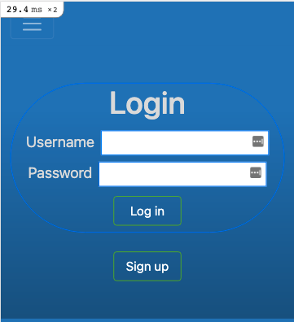
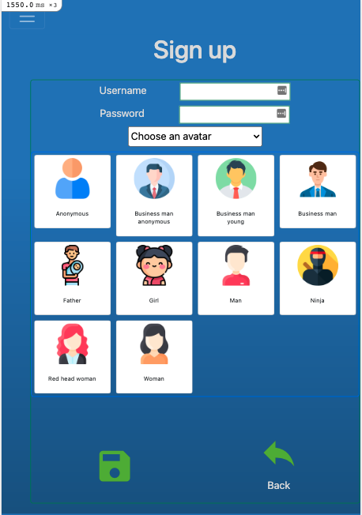
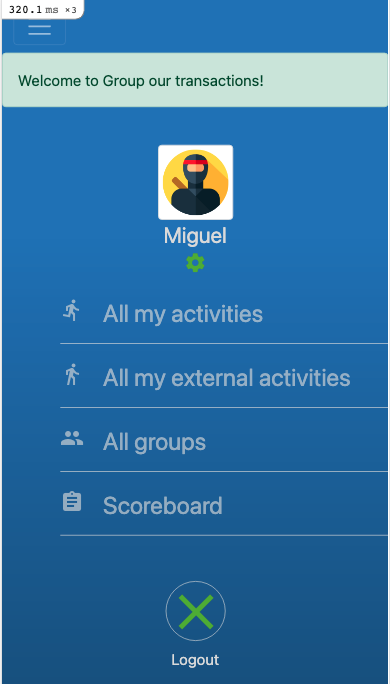
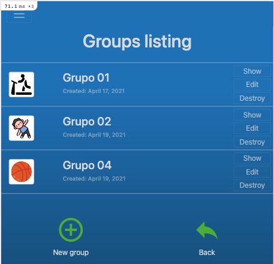
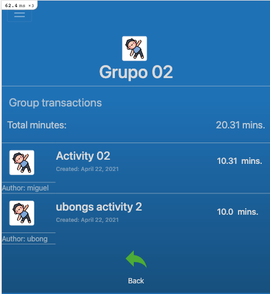
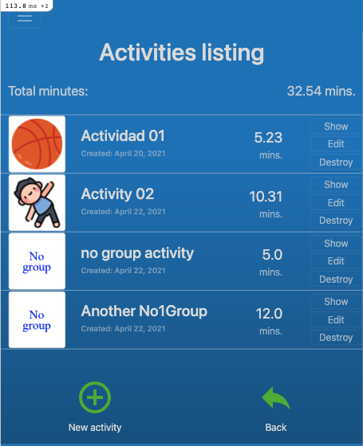

## Project: RoR Capstone project: Group my transactions

## Features

- This app is for having a record of all physical activities you practice 
- The app lets you signup with a usernam and password for security
- You can create Activities and group them (or not)
- You can create groups for grouping all your activities

Try it, share it with your family and compete against each other!

- Extra features to be added: Users scoreboard


## Screenshots

Login page:


Signup page:


Welcome page:


Groups page:


Group details page:


Activities page:


## Built With

- Ruby 3.0.
- Rails 6.1.3

## Live Demo

Visit the [Group my activities](https://obscure-earth-54566.herokuapp.com/users/1) webapp to test my app

## Prerequisites
- Ruby 3.0.
- Rails 6.1.3
- Postgres: >=9.5
- Node.js
- Yarn

## Getting Started

- Open your terminal - Windows: `Win + R`, then type `cmd` | Mac: `Command + space`, then type `Terminal`
- Navigate to a directory of your choosing using the `cd` command
- Run this command in your OS terminal: `git clone git@github.com:MiguelArgentina/ror-social-scaffold.git` to get a copy of the project.
- Navigate to the project's directory using the `cd` command
- Install gems with: `bundle install`
- Setup database with:

```
   rails db:create
   rails db:migrate
```

### Usage

Start server with:

```
    rails server
```

Open `http://localhost:3000/` in your browser.

### Run tests

Run `rspec test` from the command line to run all the tests

### Database model
- Model:
    [Link to the model](https://lucid.app/lucidchart/invitations/accept/inv_29386635-2ef0-4872-a19f-28caddeadd57?viewport_loc=137%2C-214%2C2517%2C1262%2C0_0)

### Video with a presentation on how the bot works

[Link to the video](https://www.loom.com/share/4e785bb6aa1b46a88ca832df3740d493)

## Author


### Miguel Gomez


* GitHub: [@MiguelArgentina](https://github.com/MiguelArgentina)
* twitter - https://twitter.com/Qete_arg

## 🤝 Contributing

Contributions, issues, and feature requests are welcome!

Feel free to check the [issues page](https://github.com/MiguelArgentina/ror-capstone-group-our-transactions/issues).

## Show your support

Give a ⭐️ if you like this project!

## 📝 License

This project is [MIT](https://github.com/MiguelArgentina/microverse-ruby-capstone-project/blob/main/LICENSE) licensed.